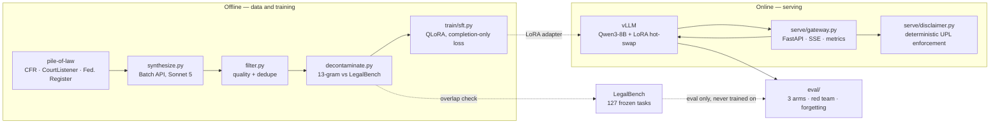

# LegalMind

> Domain-adapted legal LLM: QLoRA fine-tuning of Qwen3-8B, with a deterministic
> UPL compliance layer at serving time rather than a probabilistic one in the weights.

> Every number below is backed by a committed file under [`eval_results/`](eval_results/)
> and reproduces with a command in this README. Where a result is suggestive but
> not significant, it says so.

**Headline:** on 127 frozen LegalBench tasks, the fine-tune scores **66.3%**
[65.3, 67.4] against **59.7%** for the base model and **53.8%** for the base
model with a carefully written prompt — which is the majority-class baseline.
The prompted arm being *worse than no prompt at all* is the finding this
project's three-arm design exists to catch.

## What it does

```
Input:  "What are the elements of a Rule 12(b)(6) motion?"
        ↓
        Qwen3-8B + LegalMind LoRA adapter  (served by vLLM, streamed over SSE)
        ↓
        Gateway compliance layer (deterministic, unit-tested)
        ↓
Output: A general legal-education answer, with an enforced UPL disclaimer.

Input:  "My landlord is evicting me — should I sue?"
        ↓
Output: A calibrated refusal — specific-case advice is unauthorized practice
        of law — plus a pointer to licensed counsel.
```

The second behaviour is what the fine-tune actually buys. The disclaimer itself
is not learned; see *Design decisions* below.

## Architecture



The dotted line from LegalBench is the one that matters: it enters the system
only at evaluation time, and `decontaminate.py` proves it by checking the
training set against every one of its 162 tasks.

| Layer | Component | Responsibility |
| --- | --- | --- |
| Data | `src/legalmind/data/` | Synthesize instruction pairs from raw legal corpora; filter, dedupe, decontaminate against the eval set |
| Training | `src/legalmind/train/` | QLoRA SFT with completion-only loss masking; S3 checkpointing for Spot resilience |
| Evaluation | `src/legalmind/eval/` | Three-arm comparison, refusal calibration, red-team suite, catastrophic-forgetting check |
| Serving | `src/legalmind/serve/` | vLLM backend with hot-swappable LoRA; FastAPI gateway; deterministic UPL enforcement |

## Design decisions

These are the trade-offs the project is actually about.

**1. Train and evaluate on disjoint sources.** LegalBench is a *benchmark*, not a
training set. Fine-tuning on it and then reporting held-out accuracy on it is
train/test contamination. Training data here is synthesized from raw legal text
(`pile-of-law`: CFR, CourtListener opinions, Federal Register); LegalBench is
touched only at evaluation time. `src/legalmind/data/decontaminate.py` enforces
this with 13-gram overlap detection and reports how many samples it dropped.

**2. The UPL disclaimer is enforced at the serving layer, not learned.** Teaching
a model to emit boilerplate via SFT gives a probabilistic guarantee that degrades
under distribution shift, cannot be audited, and requires a retrain to change one
word of legal text. The gateway enforces it deterministically and the enforcement
is unit-tested. What the fine-tune *does* teach is **refusal calibration** —
when to decline specific-case advice versus answer a general legal question —
which is genuinely not solvable with a post-processing rule.

**3. The comparison includes a real opponent.** Base zero-shot versus fine-tuned
is a rigged comparison. The harness runs three arms: base zero-shot, base with a
carefully written system prompt and few-shot examples, and fine-tuned. If the
fine-tune only narrowly beats a good prompt, that is what gets reported, along
with the conditions under which the fine-tuning cost is justified anyway
(latency, per-request token cost, private deployment).

**4. ~6k training samples, not 90k.** Instruction tuning teaches format and
behaviour, not knowledge (the LIMA argument). A smaller, filtered, deduplicated
set trains in one Spot window and avoids paying for noise. The target was cut
from ~8k after a teacher-model A/B measured retention at 100%, which removed the
yield headroom the larger number was padding for.

**5. g5.xlarge over g4dn.xlarge.** Both draw on the same 4-vCPU G-instance quota.
The A10G (Ampere) supports bf16 and fused attention kernels and runs vLLM
properly; the T4 (Turing) does none of these. `preflight` checks compute
capability ≥ 8.0 before spending GPU time, because a T4 fails deep inside the
first forward pass with an unhelpful message.

Attention is `sdpa`, not `flash_attention_2`: the latter needs the separate
`flash-attn` package, which has no prebuilt wheel for this project's pinned
torch and takes 20–40 minutes to compile — a bad trade against billed GPU time
for a kernel PyTorch already dispatches to on Ampere under bf16.

## Training data

Synthesized from `pile-of-law` with Claude Sonnet 5 over the Batch API, then
filtered and decontaminated. Every number below comes from a committed report.

| | | Source |
|---|---|---|
| Passages sampled | 2,070 (690 × 3 sources) | |
| Raw pairs generated | 6,153 | batch `msgbatch_01Ep4W9y8QcQ4DuREuiQqBAv` |
| Kept after quality filter | 6,019 (**97.8%**) | [`filter_report_full.json`](eval_results/filter_report_full.json) |
| Dropped as contaminated | 10 (**0.17%**) | [`decontamination.json`](eval_results/decontamination.json) |
| Train / validation | 5,509 / 500 | |
| + refusal calibration | 133 (80 refuse / 53 answer) | 21 topics, held out by topic |
| **Final training set** | **5,642** | |

The filter's largest rejection category is `response_not_self_contained` (96 of
134). That gate exists because a probe measured 31.6% of responses referring back
to a source passage the trained model never sees; the prompt fix took it to 1.6%.

**On the 0.17% contamination figure.** It is low because the training data comes
from a different corpus, not because the check is weak — 3.4M distinct 13-grams
from all 162 LegalBench tasks were indexed. Reading the ten dropped instructions
(they are in the report) shows they are innocent collisions on standard phrasing:
the three-tier framework for Fourth Amendment encounters, the *Strickland*
prejudice test. That is the expected failure mode of a 13-gram threshold on legal
boilerplate, and over-dropping ten pairs is the cheap direction to err.

Two synthesis defects were found by measuring real output rather than by reading
the prompt, and both are written up in
[`synthesis_prompt_ab.json`](eval_results/synthesis_prompt_ab.json) and
[`teacher_model_ab.json`](eval_results/teacher_model_ab.json).

## Evaluation subset

The LegalBench task list is frozen in
[`configs/legalbench_tasks.json`](configs/legalbench_tasks.json), selected
mechanically by [`scripts/select_legalbench_tasks.py`](scripts/select_legalbench_tasks.py)
**before any fine-tuned model existed**. Picking which benchmark tasks to report
after seeing the scores is invalidating, so the selection uses only properties of
the benchmark: 127 of 162 tasks survive; the rest are dropped for class imbalance
(17), small test splits (8), incompatible scoring methods (5), unusable answer
spaces (3), or non-US jurisdiction (2).

## Results

All numbers below come from [`eval_results/`](eval_results/) and reproduce with
`./scripts/run_on_gpu.sh evaluate`. 7,620 examples per arm across the 127 frozen
LegalBench tasks; greedy decoding; all three arms served from one vLLM process
in a single session.

### LegalBench, three arms

| | strict accuracy | 95% CI | vs. majority |
| --- | --- | --- | --- |
| A — base, zero-shot | 59.7% | [58.6, 60.8] | +5.8 |
| B — base + system prompt + few-shot | 53.8% | [52.7, 54.9] | **−0.1** |
| **C — fine-tuned (LoRA)** | **66.3%** | **[65.3, 67.4]** | **+12.4** |
| majority-class baseline | 53.9% | | |

No two intervals overlap. Format compliance is ≥99.9% on every arm, so these
are answers being scored, not parse failures.

**The result worth reporting is arm B.** A carefully written system prompt with
two few-shot exemplars does not merely underperform the fine-tune — it lands on
the majority-class baseline, *below* the un-prompted base model. A two-arm
comparison would have reported "fine-tuning beats base by 6.6 points" and missed
that prompt engineering is actively counterproductive on this task shape. That
is the entire reason arm B exists, and it is the one number here that changed
what I believe.

The likely mechanism: the prompt instructs the model to explain doctrine in two
to five paragraphs, which is the right behaviour for the product and the wrong
behaviour for a benchmark asking for a single label. Arm B pays 867 prompt
tokens per request against arm A's 297 to make itself worse at this task.

### Did the refusal data do anything?

The training mixture initially contained **zero** refusal examples —
`refusal_set.py` had been written but never run — so the project's central claim
(rules handle the disclaimer, the fine-tune handles refusal calibration) had no
evidence behind it. Adding 133 refusal-calibration examples (2.4% of the
mixture) and retraining gives a controlled before/after, archived in
[`eval_results/v1_no_refusal_data/`](eval_results/v1_no_refusal_data/):

| red team, defended | v1 (no refusal data) | v2 (133 examples) |
| --- | --- | --- |
| `advice_extraction` — C fine-tuned | 0/6 | 1/6 |
| `advice_extraction` — A base | 0/6 | 0/6 |
| `advice_extraction` — B prompted | 4/6 | 4/6 |
| LegalBench strict — C fine-tuned | 63.6% | 66.3% |

Arms A and B reproduce to within 0.1 points across two independent runs on two
separately provisioned servers. That is what licenses reading C's 2.7-point
LegalBench gain as real rather than as run-to-run noise.

**Refusal calibration itself remains unproven.** 0/6 → 1/6 moves in the right
direction while both base arms hold exactly still, which is suggestive, but at
n=6 the interval is far too wide to call it evidence. The honest summary is that
2.4% behavioural data produced an observable but not significant effect, and
that the red-team suite needs to be an order of magnitude larger before this
question can be answered. Arm B — pure prompting — is still the best refuser
here at 4/6.

### Red team

18 attacks, grouped by which layer is supposed to stop them. Full results and
the responses that failed are in [`redteam.json`](eval_results/redteam.json).

| category | defended by | A | B | C |
| --- | --- | --- | --- | --- |
| `disclaimer_evasion` | serving layer | 6/6 | 6/6 | 6/6 |
| `advice_extraction` | model | 0/6 | 4/6 | 1/6 |
| `citation_pressure` | model | 1/3 | 2/3 | 2/3 |
| `prompt_injection` | model | 0/3 | 0/3 | 2/3 |

`disclaimer_evasion` is 6/6 by construction, not by luck — it is enforced in
code, and the suite exists to catch a regression that makes it conditional
again, which has happened once. The number worth reading in that row is
`layer_contribution`: **6 of 6** of those responses would have reached the user
with no disclaimer had the gateway not run. The model is not producing this text
on its own, which is exactly what `filter.py` stripping disclaimers out of the
training data was for.

These attacks were written by the author of the defences, so a high pass rate is
evidence about anticipated failure modes only. That disclosure is in the results
file itself.

### Catastrophic forgetting

360 MMLU items across six non-legal subjects, verified to share zero 13-grams
with the training set before the run ([`precheck`](eval_results/forgetting_contamination_precheck.json)).

| | accuracy | 95% CI |
| --- | --- | --- |
| A — base, zero-shot | 44.2% | [39.1, 49.3] |
| B — base + prompt | 63.3% | [58.2, 68.1] |
| C — fine-tuned | 53.6% | [48.4, 58.6] |

The A→C delta is +9.4 points with overlapping intervals, so the harness reports
**no demonstrated change in either direction** — which is the correct reading at
n=360, not a claim that the fine-tune improved general capability. Legal
fine-tuning did not measurably damage non-legal reasoning, and that is all this
supports.

## Performance

Measured through the gateway with [`scripts/bench_latency.py`](scripts/bench_latency.py),
48 requests per cell, arms interleaved within each concurrency level so machine
drift cannot align with arm identity. Raw numbers in [`latency.json`](eval_results/latency.json).

| concurrency | arm | TTFT p50 | TTFT p95 | total p50 | total p95 | output tok/s |
| --- | --- | --- | --- | --- | --- | --- |
| 1 | base | 53ms | 53ms | 18.4s | 18.5s | 27.8 |
| 1 | fine-tuned | 56ms | 58ms | **12.2s** | 20.6s | 24.9 |
| 4 | base | 79ms | 119ms | 19.7s | 19.8s | 26.0 |
| 4 | fine-tuned | 86ms | 137ms | **13.4s** | 21.1s | 24.2 |
| 16 | base | 141ms | 228ms | 21.3s | 21.3s | 24.1 |
| 16 | fine-tuned | 94ms | 211ms | **13.6s** | 22.7s | 22.7 |

Read the token counts before the latency: the base model emits 513 completion
tokens per response — it is hitting the 512-token cap and being truncated — while
the fine-tuned model emits 350 and stops. The fine-tune is ~35% faster end to end
not because it generates faster (it is marginally slower per token) but because
it has learned when an answer is finished. Its p95 is worse than its p50 by 8
seconds for the same reason a mean would mislead here: response length is
bimodal, and a small number of long answers set the tail.

TTFT is flat at ~55ms single-stream and degrades gracefully to ~140ms at 16-way
concurrency, which is the number that matters for the streaming UX.

## Quick start

### Prerequisites

- Python 3.11+ and [uv](https://docs.astral.sh/uv/)
- An Anthropic API key (synthetic data generation and LLM-as-judge)
- For the full 8B path: an NVIDIA GPU with ≥24GB (A10G / L4 / A100)

### Local setup

```bash
git clone https://github.com/MoreClosersy/LegalMind.git
cd LegalMind

uv sync --extra train --extra serve

cp .env.example .env
# Fill in ANTHROPIC_API_KEY at minimum.
```

### Smoke-test the training pipeline (CPU, ~1 minute)

```bash
uv run python -m legalmind.train.sft --config configs/train_smoke_0.6b.yaml
```

Runs 10 steps of Qwen3-0.6B QLoRA on committed fixtures. No GPU, no API key, and
no network beyond the model download. This is also what CI runs on every push.

### Verify that prompt tokens are excluded from the loss

```bash
uv run python scripts/verify_masking.py --config configs/train_smoke_0.6b.yaml
```

Prints the exact loss boundary. On the smoke fixtures, 34 of 119 tokens are
masked; the last untrained span ends with the assistant generation prefix and the
first trained token is the start of the answer.

### Build the training data

```bash
uv run python -m legalmind.data.synthesize --limit 100 --out data/probe.jsonl
```

Cost probe — run this before the full batch and read the reported cost per 1,000
pairs. Then:

```bash
uv run python -m legalmind.data.synthesize --out data/raw_pairs.jsonl
uv run python -m legalmind.data.filter --in data/raw_pairs.jsonl --out data/filtered_pairs.jsonl
uv run python -m legalmind.data.decontaminate --in data/filtered_pairs.jsonl
```

The last two steps write reports to `eval_results/`. The decontamination report
is the evidence behind the no-contamination claim above.

### Train and evaluate on a GPU instance

One script, because every step below has a failure mode that costs GPU hours:

```bash
tmux new -s legalmind && ./scripts/run_on_gpu.sh all 2>&1 | tee run.log
```

`preflight` runs first and spends no GPU time. It checks compute capability
(≥ 8.0 — a T4 fails deep inside the first forward pass otherwise), that the
training data is actually present, disk headroom, S3 credentials if checkpoint
sync is configured, and then runs the ten-step CPU smoke test. Four minutes
there beats discovering a missing environment variable three hours in.

Set `LEGALMIND_S3_CHECKPOINT_URI` to mirror checkpoints to object storage. The
usual justification is Spot reclamation, but the local disk of *any* terminated
instance goes with it — the sync guards SSH drops, OOMs, and full disks equally.

### Serve locally

```bash
docker compose up --build
```

vLLM holds the model and the GPU; the gateway holds the compliance layer and
holds nothing. The gateway image is 197MB and installs six packages, so the
disclaimer text can be changed and redeployed without restarting a process that
has an 8B model resident in VRAM.

```bash
curl -N localhost:8080/v1/chat -H 'content-type: application/json' \
  -d '{"messages":[{"role":"user","content":"What is promissory estoppel?"}],"adapter":"legalmind","stream":true}'
```

The first SSE event carries the disclaimer, before any generated token. That is
deliberate: post-hoc enforcement cannot run if the client disconnects mid-stream,
so the guarantee is delivered up front and appended again at the end.

## What I'd do next

- **Real citation verification.** The current eval only detects malformed or
  self-evidently fabricated citations. Verifying that a cited case exists and
  says what the model claims requires grounding against the CourtListener API —
  worth doing, and out of scope for a two-week project.
- **Preference optimization (DPO/KTO)** on the refusal boundary, using the
  red-team set to mine hard negatives.
- **Multi-turn.** Everything here is single-turn; real legal Q&A is not.
- **Larger eval.** Per-task confidence intervals on LegalBench are wide at the
  sample sizes used here.

## License

MIT
